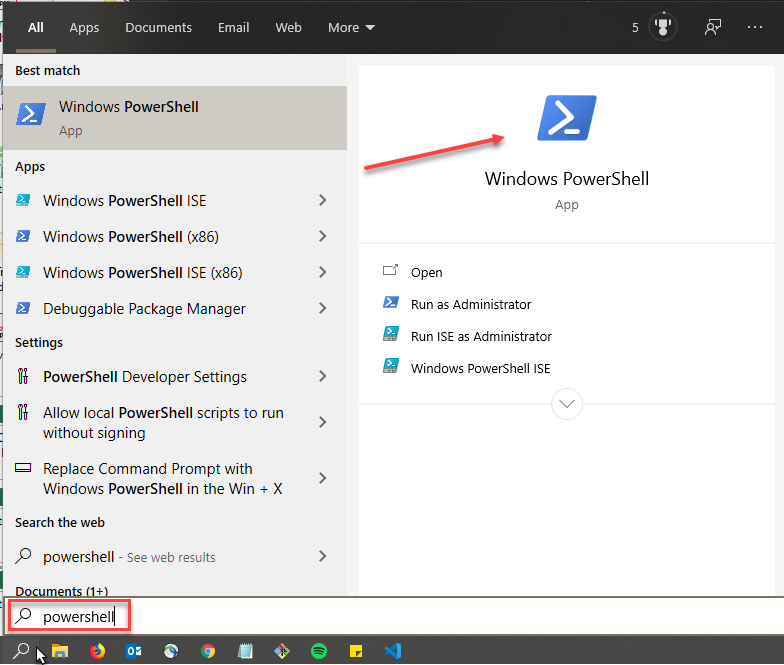

# Setting up Highly Available and Secure Infrastructure with Terraform

## Setting up your Tenancy

### Introduction

This lab walks you through how to set up Infrastruce as code using Terraform on OCI. 

Estimated Time: 20 minutes

### Objectives

In this lab, you will:
* Generate and Access SSH public and private Keys
* Generate an API Key on the OCI Console
* Create Compartments
* Gather OCIDS

### Prerequisites

This lab assumes you have:
* An Oracle account
* Familiarity with Networking is desirable, but not required
* Some understanding of cloud, networking, and Terraform
* Familiarity with Oracle Cloud Infrastructure (OCI) is helpful

## Task 1: Generate SSH Key

The SSH (Secure Shell) protocol is a method for secure remote login from one computer to another. SSH enables secure system administration and file transfers over insecure networks using encryption to secure the connections between endpoints. SSH keys are an important part of securely accessing Oracle Cloud Infrastructure compute instances in the cloud.

If you already have an SSH key pair, you may use that to connect to your environment.

### 1. **On Mac**

	

  ```
  ssh-keygen <copy></copy>
  ```

  On Mac, start up the terminal by using cmd + space and typing terminal or cmd + shift + U and click on terminal

  Once in the terminal type ssh-key or copy and paste the command into the terminal, press enter. You will prompted to enter file to save your key. pressing enter will select default in your .ssh folder. Press enter twice for no passphrase. Remember where it is saved as we will reference this later when creating instances.

### 2. **On Windows 10**

  Open a Powershell command window on your Windows 10 system by clicking it’s icon/tile or by typing ‘powershell’ in the search field in the Start bar.

  

  Once in the terminal type ssh-key or copy and paste the command into the terminal, press enter. You will prompted to enter file to save your key. pressing enter will select default in your .ssh folder. Press enter twice for no passphrase. Remember where it is saved as we will reference this later when creating instances.

  ```
  ssh-keygen <copy> </copy>
  ```

  

  Verify that your keys exist

  ```
  cd .ssh <copy></copy>
  ```
  ```
  ls <copy></copy>
  ```
  ```
  cat id_rsa.pub <copy></copy>
  ```

  

## Task 2: Generate an API Key on the OCI Console

1. **Profile**

  

    Once logged in to your tenancy click on your profile on the top right corner and click on profile.

2. **API keys**

  

    On the lower left side you will see resources, click on API keys.

    Next, click on Add API key.

3. **Add API key**

  

    An API key is an RSA key pair in PEM format used for signing API requests. You can generate the key pair here and download the private key. If you already have a key pair, you can choose to upload or paste your public key file instead.

    Make sure to click on generate API key pair. 
    
    Click on Download private key and save it. 
    
    Click on Add.

    This will add the new API Key. Copy the configuration as we will be referencing this later.

    Make sure to keep your API Key secure as this key allows you to access OCI resources.

    


## Task 3: Create Compartment

A compartment is a logical folder where you can organize your resources. For this Lab we will create a compartment to hold our resources like compute and networking services. 

1. **Navigation Menu**

  

  Click on the Navigation menu on the top left of the console.

2. **Compartments**

  

  Click on Identity & Security and then compartments under Identity

3. **Create Compartment**

  

  Click on create compartment, Give it a name like terraform and a description (optional). 

  Select parent compartment as the root compartment.

  Click Create Compartment.

  

4. **Compartment OCID**

  Most types of Oracle Cloud Infrastructure resources have an Oracle-assigned unique ID called an Oracle Cloud Identifier (OCID). It's included as part of the resource's information in both the Console and API.

  The last piece of information needed from the compartment is the OCID.

  Click on your newly created compartment and copy the OCID.

  We will be referencing the OCID on the next Task.

  

## Task 4: Setting up Terraform

  Terraform is used to automate the process of provisioning and managing resources. We will install Terraform on to our local machine in this step. 

1. **Terraform**
    
  Download [Terraform](https://www.terraform.io/downloads.html/)

  For macOS follow these steps: 
  ```
  brew tap hashicorp/tap <copy></copy>
  ```
  ```
  brew install hashicorp/tap/terraform <copy></copy>
  ```

  After Installing Terraform, please download our Terraform Template as we will be using this for the rest of the lab. 
  
  Download the [Terraform template](files/starter-file.sql) Terraform template. 

## Learn More

* [Required Keys and OCIDs](https://docs.oracle.com/en-us/iaas/Content/API/Concepts/apisigningkey.htm#Required_Keys_and_OCIDs)
* [Compartments](https://docs.oracle.com/en/cloud/foundation/cloud_architecture/governance/compartments.html#what-is-a-compartment)
* [OCIDs](https://docs.oracle.com/en-us/iaas/Content/General/Concepts/identifiers.htm)
* [OCI Provider](https://registry.terraform.io/providers/oracle/oci/latest/docs)

## Acknowledgements
* **Author** - Germain Vargas, Cloud Engineer
* **Contributors** -  David Ortega, Cloud Engineer and Hoyoung Kim, Cloud Engineer
* **Last Updated By/Date** - Germain Vargas, July 2023
